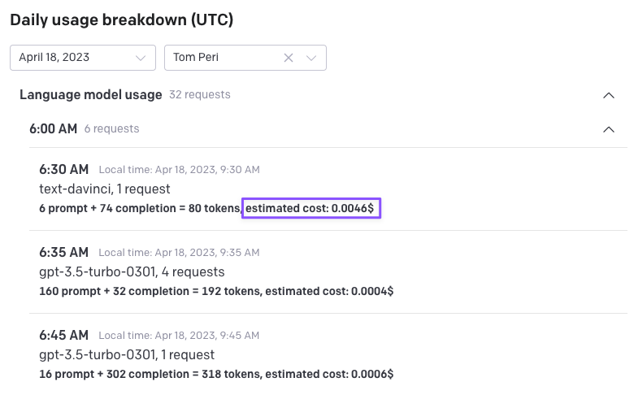

# OpenAI Usage Dashboard Cost Estimator

This Chrome extension enhances the OpenAI usage dashboard by providing estimated costs for the usage of different models.

## Features

- Automatically adds estimated costs to the usage dashboard for each model
- Updates estimated costs whenever the usage dashboard content changes

  

## Installation

1. Download or clone this repository to your local machine
2. Open the Chrome browser and navigate to `chrome://extensions/`
3. Enable "Developer mode" by toggling the switch in the top right corner
4. Click the "Load unpacked" button and select the folder containing the downloaded or cloned repository
5. The extension is now installed and ready to use

## Usage

1. Open the OpenAI usage dashboard in your Chrome browser
2. The extension will automatically add estimated costs to the usage rows for each model
3. The estimated costs will update whenever the usage dashboard content changes

## Contributing

Contributions are welcome! Please open an issue or submit a pull request if you have any improvements, bug fixes, or suggestions.

## License

This Chrome extension is released under the [MIT License](https://choosealicense.com/licenses/mit/).
